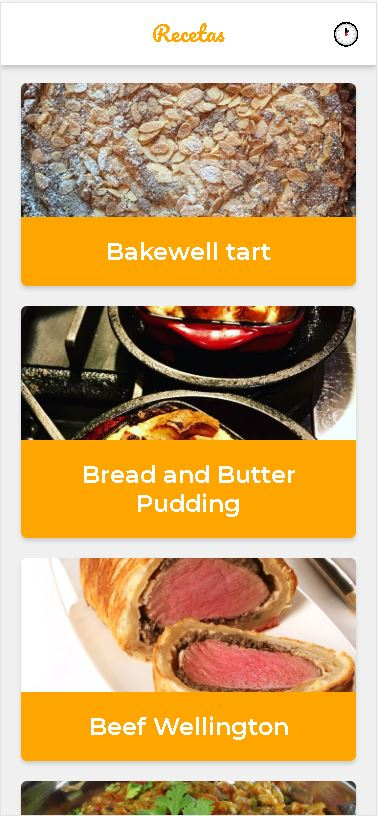

# PWA Recetas con soporte offline (Android)

Es una PWA que utiliza la API de MealDB para mostrar recetas con sus instrucciones. Algunas de las features que tiene son:

- Soporte Offline con Workbox
- Estrategias de red apropiadas para cada recurso
- Add to Home Screen
- Web Share API

## Scripts para la ejecución

- `yarn install`
- `yarn dev`
- `yarn build && yarn start`

[Ver la app en producción](https://recetas-pwa-two.vercel.app/)

## Licencia

MIT
